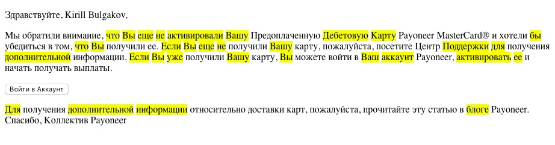
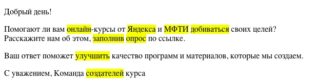
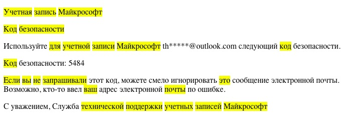

Used multiplier value: **10000**
Highlight threshold: **0.25**


```
Ваш: 0.8918617614269788
Вашу: 0.8918617614269788
Вы: 2.1086369770580298
Дебетовую: 9.157509157509157
Для: 85.47008547008546
Если: 1.7208742040956806
Здравствуйте: 0.2012639375276738
Карту: 0.28777806555584334
Коллектив: 0.10256410256410256
Мы: 0.1665001665001665
Поддержки: 1.282051282051282
Спасибо: 32.05128205128205
Центр: 0.14340618367464006
аккаунт: 32.05128205128205
активировали: 2.035002035002035
активировать: 2.035002035002035
блоге: 14.245014245014245
бы: 3.2873109796186717
в: 0.0005891572211999035
внимание: 0.20158039025963553
войти: 0.02781625693320204
выплаты: 0.09413005007718664
для: 85.47008547008546
дополнительной: 0.4819741661846925
доставки: 0.21051745189676224
ее: 0.4940467368213033
еще: 1.885369532428356
и: 0.000437000118295932
информации: 2.513826043237808
карт: 0.28777806555584334
карту: 0.28777806555584334
можете: 0.04923392020166214
начать: 0.0522007850998079
не: 85.47008547008546
обратили: 0.03486677405633076
относительно: 0.12186799259042605
пожалуйста: 23.31002331002331
получать: 0.03995173830013344
получения: 0.11211642169228526
получили: 0.07309300353770137
посетите: 0.11355635802048557
прочитайте: 0.053418803418803416
статью: 0.11477630098937171
том: 0.192789666473877
убедиться: 0.11892869035726178
уже: 1.0595465140919686
хотели: 0.11487914713721166
что: 0.42806386712897565
эту: 0.1298937469150235
```

```
25: 0.002079552447040558
30: 0.007706881999004887
40: 0.0027070061107955946
Early: 2.047921359819783
А: 0.00006719505452999626
Все: 0.06521313827359085
Главный: 0.03320009030424563
Движение: 0.006126673883888502
Для: 38.91050583657587
Желание: 0.02184756082907124
Затем: 6.48508430609598
Молодая: 0.31379440190786995
Москвы: 0.01315432922129002
На: 0.15753241229382947
Она: 0.22491621870853107
Первые: 0.02056580646753482
Петербурга: 0.033894168847191534
Пользуясь: 0.015017563039975253
Размер: 0.006765867820653083
Российские: 0.1086885637893181
США: 0.0019530445132046317
Санкт: 3.24254215304799
Сейчас: 1.1791062374719963
Успешно: 9.72762645914397
Чаще: 0.01387678524842221
аргументируют: 0.23871475973359435
банках: 0.028716240469797698
бизнес: 0.25768546911639656
больше: 0.03551849003795151
быстрее: 0.02071911918880505
быть: 0.019205580373433305
в: 0.0006556379971329666
вашего: 0.06767044493317544
вне: 2.7793218454697057
воплотить: 0.04503530768122208
все: 0.06521313827359085
всего: 0.5480352934728997
всему: 0.06521313827359085
вышедший: 0.010769583680203676
где: 0.2683483161143164
годового: 0.020140013372968883
годы: 0.012282356640333295
две: 0.036847069920999884
денег: 0.033894168847191534
деньги: 0.033894168847191534
депозит: 0.3653568623152665
депозиты: 0.3653568623152665
для: 38.91050583657587
должен: 0.03223737020428822
досрочно: 1.7686593562079944
достаточную: 0.04566960778940831
достаточный: 0.04566960778940831
достичь: 0.02728646973111913
доход: 0.0996427806314363
дохода: 0.0996427806314363
ее: 0.22491621870853107
ему: 0.12619623514565148
еще: 0.28610666056305795
женщина: 0.029278032984631962
жизнь: 0.20108788546034045
житель: 0.025119758448402762
зависимости: 0.07454119892064345
заработка: 0.056638290882934324
зародившееся: 0.08089502252926378
заслуженный: 0.03148099177716495
золото: 0.05480352934728997
и: 0.0002652607721951961
из: 0.07689823287860846
имеющегося: 0.01073097237633091
инвестировать: 0.32975004946250747
инвестируют: 0.32975004946250747
инвестициям: 0.0807271905323151
инструментах: 0.04604793590127323
интернет: 0.2329970409375801
ипотеку: 0.09155413138017854
к: 0.00045047820964823424
как: 0.26009696414823447
капитала: 0.11344170797835533
квартиры: 0.02229828414703489
комфортную: 0.06790664194864901
консервативных: 0.04406625802556725
контролировать: 0.024910695157859077
которой: 0.1263328111577139
кто: 0.12046596234234018
лет: 0.012282356640333295
лучшие: 0.007379197010539708
льготами: 0.156897200953935
льготным: 0.06431488568029071
людей: 0.06286026791046184
малый: 0.08763627440670244
менее: 3.891050583657588
минимальную: 0.014971337374596336
миру: 0.10660412557965994
млн: 0.030069942686689242
можно: 1.852881230313137
молодые: 0.31379440190786995
молодых: 0.31379440190786995
муниципальную: 0.07100457269448153
на: 0.15753241229382947
надежных: 0.019234061214323223
надо: 0.3269790406434948
называют: 0.002255943056387748
накопления: 0.06517672669443196
не: 25.94033722438392
небольшим: 0.012072760110634774
небольшой: 0.012072760110634774
недвижимости: 0.4472471935238606
недвижимость: 0.4472471935238606
необходимо: 0.02981647956825738
нескольких: 0.01997459231857078
облигации: 0.03946298766387006
обсуждая: 0.0432338953739732
ограничить: 0.08904005912259927
он: 0.12619623514565148
они: 0.09583868432654158
оставить: 0.006506773551266869
от: 0.10266624231286511
отдавать: 0.061421477247949295
отдавая: 0.061421477247949295
отдых: 0.5188067444876784
открыл: 0.02227275663227011
отложит: 0.05705352761961273
отправиться: 0.04774295194671887
пенсионеров: 0.08226322587013928
пенсию: 0.10554386754948249
перестать: 0.02588856010417557
план: 0.019464985410993438
по: 0.06490493050304567
погасив: 0.06357925790290177
подрабатывая: 0.11935737986679718
покупку: 0.04234004987657876
половину: 0.00783853864556323
посвященных: 0.012356464222475669
потребление: 0.0817447601608737
предпочтение: 0.05558643690939411
предприниматель: 0.06583841935122822
примерно: 5.5586436909394115
приносили: 0.023341635174910544
приобрести: 0.015772397988072916
приобретал: 0.0145080185818702
работать: 0.01602904462886751
работая: 0.01602904462886751
работу: 0.008393120327130259
размера: 0.006765867820653083
рантье: 0.5053312446308555
раньше: 0.019791712022673387
распространяется: 0.046157183673281
рассказал: 0.011546144165156048
ресурсах: 0.024063392601469315
рублей: 0.04827606183198
рынок: 0.022336685325244476
с: 0.00023609454481597413
сберегать: 0.5532299408043964
своего: 0.254317031611607
свой: 0.254317031611607
свою: 0.254317031611607
сделал: 0.00599084000563139
сейчас: 1.1791062374719963
сколько: 0.14098009361078218
скопить: 0.10002700729196884
смогла: 0.11007215229582992
сможет: 0.11007215229582992
совет: 0.017743048717088865
советуют: 0.13348372499682978
созданию: 0.05705352761961273
старается: 0.01615884793877736
студенческие: 0.03698717284845616
сумму: 0.11256655497562934
считает: 0.012786889857566834
так: 12.97016861219196
такой: 0.034342900120543585
там: 0.23161015378914213
тем: 2.7793218454697057
теме: 0.06561636734667096
течение: 0.00942142998464307
того: 0.1755361165559814
удалось: 0.09513571109187256
уйти: 0.025565378342034085
умноженного: 0.06948304613674264
уровня: 0.008455129473397627
фондовый: 0.08089502252926378
хватает: 0.06862523075233841
хотят: 0.06973208931286
хочет: 0.06973208931286
ценам: 0.0290160371637404
что: 0.12991821648272414
чтобы: 2.0265888456549934
этого: 0.41839253587715997
```

```
5: 0.003650103954960637
16: 0.006890753986301181
17: 0.003740801369432565
630: 0.47673531655225015
990: 1.529987760097919
2018: 4.6992481203007515
3060: 10.964912280701753
Гаджет: 4.1118421052631575
Декабря: 0.8122157244964262
Интернет: 0.7878978884336589
Москва: 0.02224120138073378
Мп: 2.990430622009569
Отметим: 0.028151251041596288
Разрешение: 0.03482767267560112
Сведения: 0.04487685790191714
Согласно: 8.223684210526315
Сообщается: 0.13997760358342665
Также: 4.385964912280701
а: 0.0002272253817659084
батареи: 0.08296276631047984
будет: 0.1948355587883826
был: 0.1948355587883826
была: 0.1948355587883826
были: 0.1948355587883826
в: 0.00030233067929995045
время: 0.014462403535768414
выглядеть: 0.11169689929407559
выложил: 0.07518796992481203
данным: 0.025549310168625446
декабря: 0.8122157244964262
должна: 0.05450660620067151
ее: 0.12676199168441332
зарядом: 0.08878471482349598
и: 0.0005606251517612285
из: 0.13001872269606823
известна: 0.017427675148135237
изготовлен: 0.06638695629082797
именно: 2.2686025408348454
интернет: 0.7878978884336589
информация: 0.6449948400412796
как: 0.08795384182381086
камеры: 0.04895050125313283
корпус: 0.047742724008861044
которая: 0.6408065618591934
которого: 0.6408065618591934
которые: 0.6408065618591934
мАЧ: 5.06072874493927
магазин: 0.041351020543187005
магазина: 0.041351020543187005
металла: 0.04466359381141244
на: 0.11837961976466131
назначен: 0.02360583914036976
некоторое: 0.014619883040935672
некоторым: 0.014619883040935672
новинка: 0.29502006136417275
нового: 0.996810207336523
о: 0.0009239186271603988
обнародованным: 0.11094346321114759
однако: 0.4802151363810987
опубликована: 0.036167934955585776
оснащен: 0.04729653032653524
основной: 0.04675868776418658
официальная: 0.06658853611762199
ошибке: 0.22843567251461985
пластика: 0.16825952348902945
по: 0.16461085992713226
показал: 0.017656863576009266
полностью: 4.385964912280701
порядке: 0.05916319575918212
появлялись: 0.05980861244019138
презентация: 0.35561877667140823
причем: 0.14652444027663813
ранее: 21.929824561403507
релиз: 3.132832080200501
рублей: 0.08162465717643985
с: 0.0003991861711691141
сайте: 0.0783674492962603
сведения: 0.04487685790191714
сети: 0.19124847001223988
сеть: 0.19124847001223988
смартфона: 5.482456140350877
совпадают: 0.04004228465259314
составит: 0.042540881787397684
состояться: 0.04685859949017843
сохранить: 0.03620774556093039
специалистам: 0.28235825615540994
спустя: 5.482456140350877
срочном: 0.046659201194475544
стала: 0.028109153464734252
станет: 0.028109153464734252
стоимость: 0.06344211541389636
только: 32.89473684210526
том: 0.09893153937475266
удалены: 0.14427516158818096
удалось: 0.1608544588856003
уже: 0.5437146585471944
указанными: 0.049502989980594825
успеть: 0.03671287593984962
устройства: 0.03252074823737544
фото: 2.860411899313501
фронтальной: 0.37380382775119614
характеристики: 0.06289624635201771
чипом: 0.7309941520467835
что: 0.21966435286881641
```

```
Ваш: 0.45766590389016015
Добрый: 0.1867692652497105
Команда: 0.22058499139718532
МФТИ: 5.263157894736842
Помогают: 0.18650453206012904
Расскажите: 0.07808839606434483
С: 0.0015967446846764564
Яндекса: 7.974481658692184
вам: 0.8656509695290858
день: 0.555185431934266
добиваться: 0.4624919063916381
заполнив: 0.1201634222542658
и: 0.0008970002428179656
качество: 0.0624484800039967
которые: 0.8544087491455912
курса: 0.5771006463527238
курсы: 0.5771006463527238
ли: 1.074113856068743
материалов: 0.20902136198319465
мы: 0.683526999316473
нам: 0.683526999316473
об: 0.0036956745086415953
онлайн: 52.63157894736842
опрос: 0.1698888926641976
от: 0.3471740036106096
ответ: 0.295351172544155
по: 0.21948114656950965
поможет: 0.40176777822418636
программ: 0.17335829692809096
своих: 0.5733287467033596
создаем: 0.08267605866693123
создателей: 0.3256904637832204
ссылке: 0.13564839934888767
уважением: 0.2559901699774728
улучшить: 0.4170489615480857
целей: 0.03685168670170033
этом: 2.8296547821165814
```

```
com: 13.333333333333334
outlook: 8
th: 25
Возможно: 15.384615384615385
Если: 1.342281879194631
Используйте: 0.0499001996007984
Код: 1.2861736334405145
Майкрософт: 16.216216216216218
С: 0.0012135259603541068
Служба: 0.22753128555176336
Учетная: 1.3921113689095128
адрес: 0.20202020202020202
безопасности: 2.027027027027027
ваш: 0.34782608695652173
ввел: 0.13271400132714
вы: 0.6578947368421053
для: 66.66666666666667
записей: 0.423728813559322
записи: 0.423728813559322
запись: 0.423728813559322
запрашивали: 0.823045267489712
игнорировать: 0.24154589371980675
код: 1.2861736334405145
кто: 0.6191950464396285
можете: 0.07680491551459294
не: 66.66666666666667
ошибке: 0.23148148148148148
по: 0.16680567139282734
поддержки: 2
почты: 2.185792349726776
следующий: 0.10695187165775401
смело: 0.09456264775413711
сообщение: 0.1142204454597373
технической: 0.7722007722007722
то: 0.5681818181818182
уважением: 0.19455252918287938
учетной: 1.3921113689095128
учетных: 1.3921113689095128
электронной: 0.23668639053254437
это: 2.150537634408602
этот: 0.20263424518743667
```
